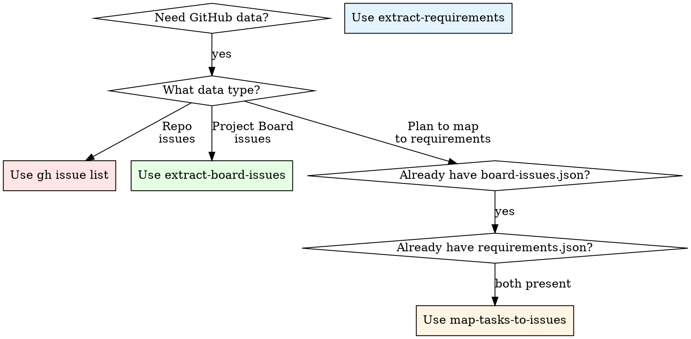

# Extract Board Issues

Extract all issues from a GitHub Project Board into structured JSON format for downstream analysis, mapping, or reporting.

## Overview

This skill automates extraction of GitHub Project Board issues into a standardized JSON file (`board-issues.json`) that captures issue metadata, descriptions, and comments. The output integrates seamlessly with the `map-tasks-to-issues` skill to correlate board issues with requirement tasks.

**Core principle:** Project Boards contain curated collections of issues organized by workflow. This skill extracts those issues with full context (comments, timestamps, state) for structured analysis.

## When to Use

Use this skill when:

✅ **You need to extract issues from a GitHub Project Board** (not general repository issues)  
✅ **You want structured JSON output** for downstream tools or analysis  
✅ **You plan to map board issues to requirements** using `map-tasks-to-issues`  
✅ **You need issue metadata** (timestamps, state, comments) preserved  
✅ **You want to audit or track issues in a specific board** over time  

```
Is this about a GitHub Project Board?
  ├─ YES → Use extract-board-issues
  └─ NO → Do you need repo issues or requirements?
           ├─ Repo issues → Use `gh issue list`
           ├─ Requirements from PDF → Use extract-requirements
           └─ Mapping tasks to issues → Use after extract-board-issues
```

### Decision Flowchart: Which Tool Do I Need?



## When NOT to Use

❌ **You want all repository issues** → Use `gh issue list` instead  
❌ **You're extracting requirements from PDFs** → Use `extract-requirements` skill  
❌ **You want to directly map tasks to issues** → Use `extract-board-issues` THEN `map-tasks-to-issues`  
❌ **You need to create or modify issues** → Use `gh` CLI directly  
❌ **Your GitHub CLI isn't authenticated** → Validate with `gh auth status` first  
❌ **You just want a quick issue count** → Use `gh issue list --search` instead  

## Quick Reference

| Task | Tool | Output | Use When |
|------|------|--------|----------|
| **Extract Project Board** | extract-board-issues | board-issues.json | Need curated board issues with full context |
| **Extract all repo issues** | `gh issue list` | CLI output | Need any/all issues from repository |
| **Extract PDF requirements** | extract-requirements | requirements.json | Parsing document-based requirements |
| **Map issues to tasks** | map-tasks-to-issues | task-issue-mapping.xlsx | Correlating board issues with requirements |

## Prerequisites

Before using this skill, ensure:

1. **GitHub CLI is installed** → Run: `brew install gh`
2. **You're authenticated** → Run: `gh auth login` (if not already authenticated)
3. **You have access to the project** → Run: `gh repo view` to verify
4. **You're in a git repository** (optional) → Script auto-detects, or use `--repo` flag

Validate prerequisites:
```bash
gh auth status                  # Check authentication
gh repo view                    # Verify repository access
gh project view                 # List available boards
```

## Core Workflow

### Step 1: Detect Repository
Script automatically detects repository name and owner from current directory using `gh repo view`, or you provide via `--repo` and `--owner` flags.

### Step 2: Validate Authentication
Script checks `gh auth status` to ensure GitHub CLI is authenticated before proceeding.

### Step 3: Fetch All Project Boards
Script retrieves all Project Board V2 items from the repository using GraphQL query.

### Step 4: Interactive Board Selection
- **Displays all available boards** with item counts
- **Auto-suggests boards** associated with the repository
- **User selects by number** (1-5, etc.) OR provides `--board` flag to skip selection

### Step 5: Extract Issues (with Pagination)
Script executes paginated GraphQL queries to extract:
- Issue number, title, body (description)
- State (OPEN/CLOSED)
- Created/updated timestamps (ISO 8601)
- All comments with author, timestamp, content
- **Handles 50 issues per page** automatically
- **Shows progress** with page count and running total

### Step 6: Validate & Save
Script validates JSON schema compliance and saves to:
```
/Users/admin/dev/Reports/{repo-name}/board-issues.json
```

## Output Format

### JSON Schema

```json
{
  "repository": "owner/repo-name",
  "board_name": "Project Board Name",
  "extracted_at": "2024-01-20T15:30:00Z",
  "total_issues": 42,
  "issues": [
    {
      "number": 123,
      "title": "Issue Title",
      "body": "Issue description...",
      "state": "OPEN",
      "created_at": "2024-01-15T10:00:00Z",
      "updated_at": "2024-01-20T15:30:00Z",
      "comments": [
        {
          "author": "username",
          "body": "Comment text...",
          "created_at": "2024-01-16T09:00:00Z"
        }
      ]
    }
  ]
}
```

### Schema Requirements

| Field | Type | Required | Notes |
|-------|------|----------|-------|
| repository | string | Yes | Format: `owner/repo-name` |
| board_name | string | Yes | Exact board title from GitHub |
| extracted_at | ISO 8601 | Yes | UTC timestamp when extracted |
| total_issues | integer | Yes | Count of issues in array |
| issues | array | Yes | Array of issue objects |
| number | integer | Yes | GitHub issue number |
| title | string | Yes | Issue title (< 500 chars) |
| body | string | No | Issue description (markdown) |
| state | string | Yes | Must be "OPEN" or "CLOSED" |
| created_at | ISO 8601 | Yes | UTC timestamp |
| updated_at | ISO 8601 | Yes | UTC timestamp |
| comments | array | Yes | Array of comment objects (may be empty) |
| author | string | Yes | GitHub username |
| created_at | ISO 8601 | Yes | Comment timestamp (UTC) |

**Validation:** JSON must validate against this schema before saving. Script will fail with clear error if structure is invalid.

## Usage

### Basic Usage (Interactive)

```bash
# Auto-detect repo, interactive board selection
python3 extract_board_issues.py
```

### With Repository Name and Owner

```bash
# Specify repo and owner (useful when not in git directory)
python3 extract_board_issues.py --repo goetz-kundenportal-phoenix --owner num42

# You will be presented with a list of all available boards to choose from
📋 Found 5 board(s):

  1. Götz Kundenportal Phoenix - Formulardesigner
     (17 items)
  2. Götz: QMS (Inventur Erweiterung)
     (9 items)
  3. goetz kundenportal subcontractor feedback
     (32 items)
  4. goetz fms erweiterung EST-001284
     (11 items)
  5. Götz: Kundenportal
     (218 items)

🎯 Select board number (1-5):
```

### With Direct Board Index (Skip Selection)

```bash
# Skip board selection, extract from board #5 directly
python3 extract_board_issues.py --repo goetz-kundenportal-phoenix --owner num42 --board 5
```

### Dry Run (Validate Only)

```bash
# Validate authentication & boards without extraction
python3 extract_board_issues.py --repo goetz-kundenportal-phoenix --owner num42 --dry-run
```

### Example Session

```bash
$ python3 extract_board_issues.py --repo goetz-kundenportal-phoenix --owner num42

🔍 Extract Board Issues

✅ Repository: goetz-kundenportal-phoenix
✅ Owner: num42
✅ GitHub authentication valid

📋 Found 5 board(s):

  1. Götz Kundenportal Phoenix - Formulardesigner
     (17 items)
  2. Götz: QMS (Inventur Erweiterung)
     (9 items)
  3. goetz kundenportal subcontractor feedback
     (32 items)
  4. goetz fms erweiterung EST-001284
     (11 items)
  5. Götz: Kundenportal
     (218 items)

🎯 Select board number (1-5): 5

📋 Selected board: Götz: Kundenportal

⏳ Extracting issues...
⏳ Page 1: Extracted 21 issues (total: 21)
⏳ Page 2: Extracted 5 issues (total: 26)
⏳ Page 3: Extracted 1 issues (total: 27)
⏳ Page 4: Extracted 7 issues (total: 34)
⏳ Page 5: Extracted 4 issues (total: 38)
✅ Found 38 issue(s)

✅ Extraction complete!
   📁 Saved to: /Users/admin/dev/Reports/goetz-kundenportal-phoenix/board-issues.json
   📊 Total issues: 38
```

## Integration with Other Skills

This skill is **PART OF A WORKFLOW CHAIN**:

```
PDF Requirements Document
        ↓
extract-requirements
        ↓
   requirements.json
        ↓
     +--------+
     |        |
     ↓        ↓
GitHub Board  (you manually create)
     ↓
extract-board-issues  ← YOU ARE HERE
     ↓
   board-issues.json
     ↓
     +--------+
     |        |
     ↓        ↓
 requirements.json + board-issues.json
     ↓
map-tasks-to-issues
     ↓
task-issue-mapping.xlsx (analysis ready)
```

### Workflow Context

1. **extract-requirements**: Reads PDF → generates `requirements.json` (what needs doing)
2. **extract-board-issues**: Reads GitHub Board → generates `board-issues.json` (what you're tracking)
3. **map-tasks-to-issues**: Reads BOTH files → generates mapping report (what's covered?)

**Critical:** These are sequential. You cannot skip or reorder them. Each output feeds the next tool's input.

## Common Mistakes

| Mistake | Why It Fails | Fix |
|---------|-------------|-----|
| "I'll use `gh api` directly" | Misses board abstraction; gets all repo issues instead of board subset | Use this skill; it handles board-specific GraphQL query |
| "I'll use extract-requirements here" | Requirements ≠ Board issues; wrong input source | Use this skill; extract-requirements is for PDFs |
| "JSON format doesn't matter" | Breaks downstream mapping (map-tasks-to-issues expects exact schema) | Follow output schema exactly; script validates |
| "I'll skip validation, save time" | Silent failures; corrupted mapping later | Script validates automatically; fast anyway |
| "I'll just extract all repo issues" | Includes issues outside the board scope; polluted data | This skill filters by board; use it |
| "Timestamps don't need ISO 8601" | Parsing breaks in map-tasks-to-issues | Script enforces ISO 8601 UTC format |
| "I can fix the format later" | Downstream tools won't accept malformed JSON | Fix BEFORE extraction, not after |
| "I don't need to check auth first" | Script fails silently on permission denied | Validate with `gh auth status` upfront |

## Red Flags - STOP and Rethink

⚠️ **"I'm not sure if I should use this or extract-requirements"**  
→ Review the **Integration with Other Skills** section above

⚠️ **"The output format doesn't match examples"**  
→ Script validation catches this; don't ignore errors

⚠️ **"GitHub auth is probably already configured"**  
→ Always run `gh auth status` first; it's 1 command

⚠️ **"I'm extracting everything manually"**  
→ Use this skill instead; it's automated and reliable

⚠️ **"gh api is taking too long"**  
→ Board might have 1000+ issues; check board size first

⚠️ **"I'm not sure which board to select"**  
→ Script filters by repo name; shows all relevant boards

⚠️ **"Comments aren't in the output"**  
→ Check that board issues actually have comments; empty comments array is OK

⚠️ **"The timestamp format is different from examples"**  
→ Verify timezone; timestamps must be UTC in ISO 8601 format

## FAQ

### Q: Does this work with GitHub Enterprise?
**A:** Yes, if `gh` CLI is configured for Enterprise. The GraphQL API is the same.

### Q: Can I extract from multiple boards at once?
**A:** No, one board per execution. Run the script multiple times for different boards, or automate with a wrapper script.

### Q: What if the board has 1000+ issues?
**A:** Script will warn if extraction times out. GitHub GraphQL has limits. Consider archiving old issues or splitting into smaller boards.

### Q: Can I extract deleted issues?
**A:** No, only issues currently in the board are extracted. Deleted issues are unavailable via GraphQL API.

### Q: What if `gh` authentication expires?
**A:** Script will fail with clear error. Re-authenticate: `gh auth login`

### Q: Can I run this in CI/CD?
**A:** Yes, use `GH_TOKEN` environment variable. Authenticate locally first: `gh auth login`, then use token in CI.

### Q: How often should I extract?
**A:** As needed. No duplicate detection—each extraction overwrites previous. Consider timestamped filenames if you need history.

### Q: The board has 50 issues but JSON shows 30. Why?
**A:** GraphQL queries paginate at 100 items; script handles pagination. If fewer items, check that board items are issues (not all board items are issues).

### Q: Can I modify the output JSON manually?
**A:** Yes, but downstream tools expect exact schema. Validate with `test_extract_board_issues.py` if you modify.

### Q: What about private boards?
**A:** Script respects your GitHub permissions. If you can see the board in GitHub, script can extract it.

## Rationalization Table

| "But I thought..." | Reality | What This Means |
|---|---|---|
| Tools are interchangeable | Each tool has specific input source and format | Use extract-board-issues ONLY for Project Boards |
| I don't need to check auth | Script needs GitHub access; unauthed calls fail | Validate auth before running |
| Output format is flexible | Downstream tools expect exact schema | Follow schema exactly; script validates |
| I can guess which board | Boards have similar names; picking wrong wastes time | Script shows all boards clearly |
| Comments aren't important | Comments are critical context for mapping | Script extracts all comments automatically |
| Timestamps can be any format | Downstream tools parse ISO 8601 only | Script enforces ISO 8601 UTC |
| I'll fix problems manually | Manual fixes are slower and error-prone | Let script handle validation |
| One tool can do all steps | Each skill specializes in one input source | Use all three skills in sequence |

## Troubleshooting

### Error: "Could not detect repository"

**Cause:** Not in a git directory or no remote configured  
**Fix:**
```bash
# Option 1: Change to git directory
cd /path/to/git/repo

# Option 2: Specify repo with --repo flag
python3 extract_board_issues.py --repo goetz-kundenportal-phoenix

# Option 3: Configure remote
git remote add origin https://github.com/owner/repo.git
```

### Error: "GitHub CLI is not authenticated"

**Cause:** `gh` CLI not configured  
**Fix:**
```bash
gh auth login
# Follow prompts to authenticate
python3 extract_board_issues.py  # Try again
```

### Error: "GraphQL Error: Unauthorized"

**Cause:** Insufficient permissions for board access  
**Fix:**
```bash
# Verify access to the repository
gh repo view goetz-kundenportal-phoenix

# Re-authenticate with proper permissions
gh auth logout
gh auth login
```

### Error: "No boards found"

**Cause:** Organization has no Project Boards, or permission denied  
**Fix:**
```bash
# Check boards exist
gh project view

# If empty, create a board in GitHub first
# Then run extraction again
```

### Issue: "Script runs but JSON is empty"

**Cause:** Board exists but has no issues  
**Fix:** This is normal. Script will create `board-issues.json` with `total_issues: 0` and empty `issues` array. This is valid output.

### Issue: "Comments are missing"

**Cause:** Script extracts all comments, but some may be deleted or private  
**Fix:** This is expected. Comments array contains only accessible comments. Empty array is valid.

## Files & Artifacts

- **extract_board_issues.py** - Main script (executable)
- **test_extract_board_issues.py** - Unit tests (pytest)
- **fixtures/sample_responses.json** - Test fixtures (GraphQL responses)
- **board-issues.json** - Output file (in `/Users/admin/dev/Reports/{repo}/`)

## Performance

- **Typical extraction:** 5-30 seconds (depends on board size)
- **Max safe board size:** ~500 issues (GraphQL pagination limit)
- **Network overhead:** Minimal (pagination handles large boards efficiently)
- **Timeout protection:** 30-60 second timeouts prevent hanging

## What's Fixed in v2.1

### Problems Solved

✅ **Script no longer hangs** - Added 30-60 second timeouts on all GraphQL queries
✅ **User must select board** - Script now prompts to choose before extracting (no silent defaults)
✅ **Better error messages** - Clear feedback on what's happening at each step
✅ **Progress visibility** - Shows page count and running issue total during extraction
✅ **Pagination handling** - Properly handles boards with 100+ issues across multiple pages
✅ **Flexible repo detection** - Works with `--owner` flag when not in git directory
✅ **Comment formatting** - Properly cleans up JSON structure for downstream tools

### Example: What Changed

**Before (v2.0):**
```
Script hangs indefinitely trying to fetch boards
No board selection shown
Unclear error messages
```

**After (v2.1):**
```
⏳ Fetching project boards for num42/goetz-kundenportal-phoenix...
✅ Found 5 board(s)

📋 Found 5 board(s):

  1. Götz Kundenportal Phoenix - Formulardesigner (17 items)
  2. Götz: QMS (Inventur Erweiterung) (9 items)
  3. goetz kundenportal subcontractor feedback (32 items)
  4. goetz fms erweiterung EST-001284 (11 items)
  5. Götz: Kundenportal (218 items)

🎯 Select board number (1-5): 5
```

## Version History

- **v2.1** (2026-04-14): Fixed hanging issues, added interactive board selection, improved error handling with timeouts
- **v2.0** (2024-01-20): Complete rewrite in Python, TDD-based approach, comprehensive documentation
- **v1.0** (2024-01-10): Original bash implementation

## Support

- **Report issues:** See AGENTS.md for support guidelines
- **Examples:** Run `python3 extract_board_issues.py --help` for all options
- **Manual testing:** Use `test_extract_board_issues.py` to validate functionality

